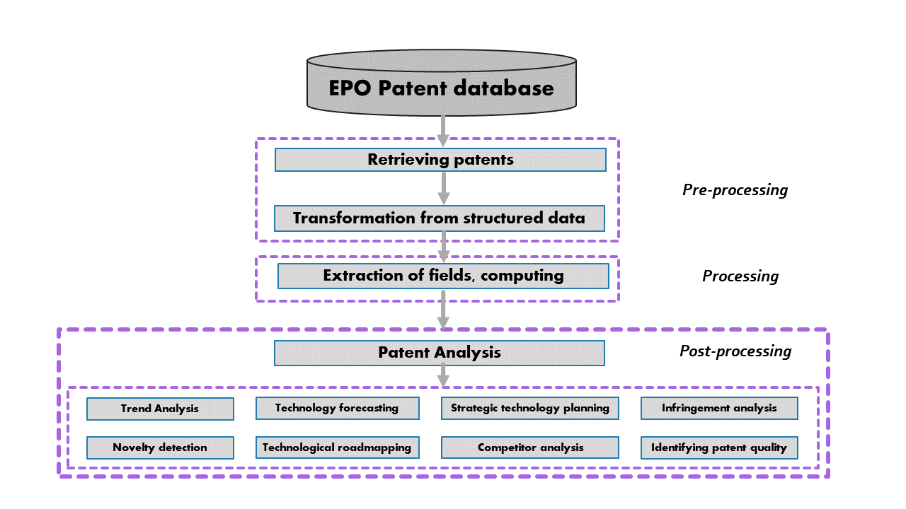
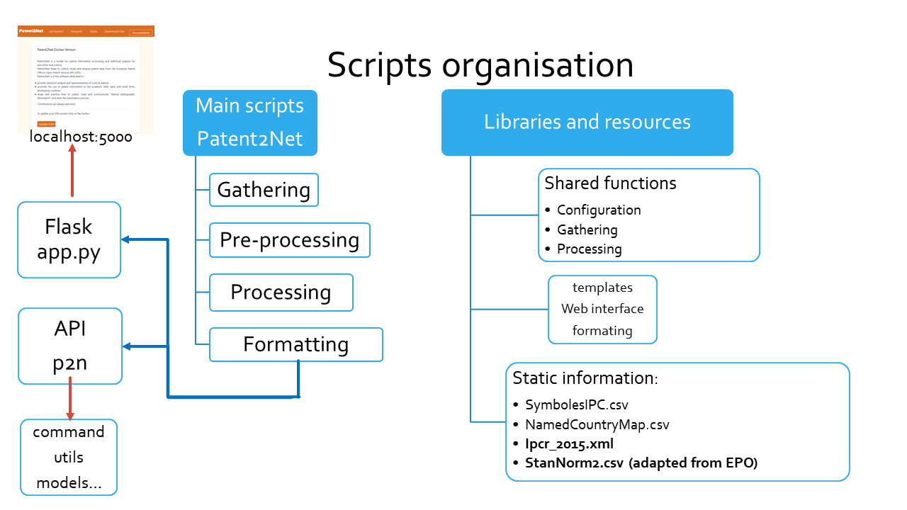

.. _datamod:

**************
P2N Data model
**************

Generalities
============
The following scheme, inspired by [Abbas et al] presents the general organisation of the Patent2Net script suite. The differents scripts of Patent2Net adresses the pre-processing and processing steps. Post processing concerns human interactions with the tool. 

Script philosophy
=================
The Generic philophy for a script is to follow the following procedure:
- open a request file (requete.cql) and set the configuration

 - read the CQL request
 - memorize the Data directory (..\DATA\Datadir) where all the stuff concerning gatherers and processors will be stocked
 - set up boolean switches (to do or not the job)

- if the according boolean for the script is set to True, go ahead

.. note: Some recent script do not have a boolean switcher and are obligatory called.

Script organisation
===================

The following scheme, presents the general organisation of the Patent2Net scripts in two categories: main and libraries.

Main scripts
------------
These scripts are separated in the four categories apearing on previous figure. They follow the generic named convention:
* a gatherer starts with *OPS-Gather* and they are used for:

 - patent gathering. *OPS-GatherPatentsv2.py* is the entry gatherer. It creates:
	- the list of patent according to the cql request retreived to the [API]. This list is stocked in ..\DATA\Datadir\PatentLists in pickeled dump format of the dictionnary returned by the API [#f1]_. 
	- It gathers then the bibliographic data: the complete set of patent metadata for each entry in previous list. This data is stocked in ..\DATA\Datadir\PatentBiblios in pickeled dump format of a list of dictionnary extracted from data.
	
 - patent familly gathering: for each patent in PatentBiblios, retreive its familly set of patent and add it.
 - patent images gathering: for each patent in PatentBiblios, retreive its media stuff and store it in ..\DATA\Datadir\PatentImages
 - patent content gathering: for each patent in PatentBiblios, retreive its [abstract, Claims and Descriptions] if present in the databas. Store it in ..\DATA\Datadir\PatentContents\[theGoodPart]

* a processor script. This category is divide mainly in two: Fusionner that adresses the production of textual data [XML], [TXT] or Formatters that prepares data for visualisation tools (json)

.. rubric:: footnotes

.. [#f1] at this time I didn't know about *xmltodict* library. Very quick cleaning can be done here.
